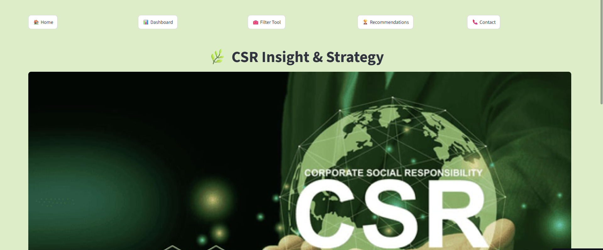
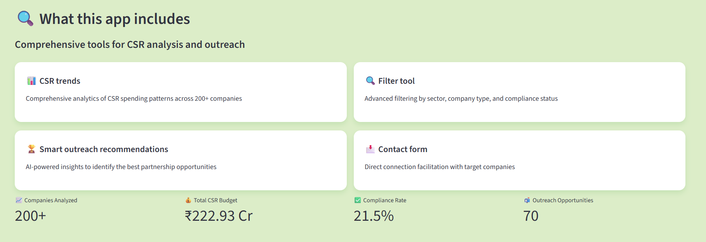
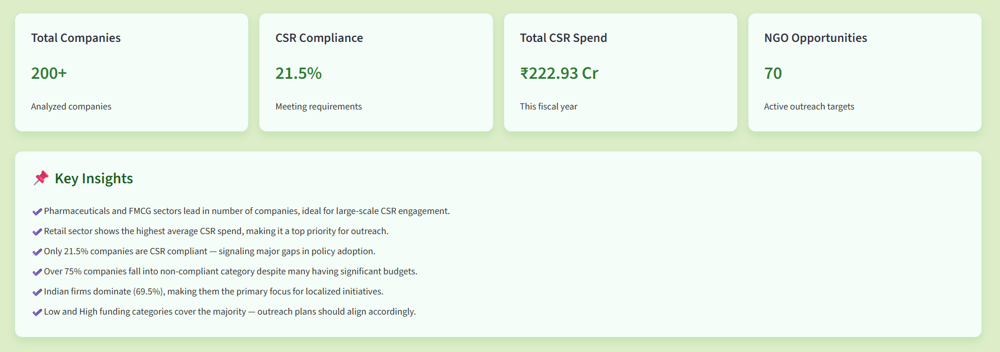
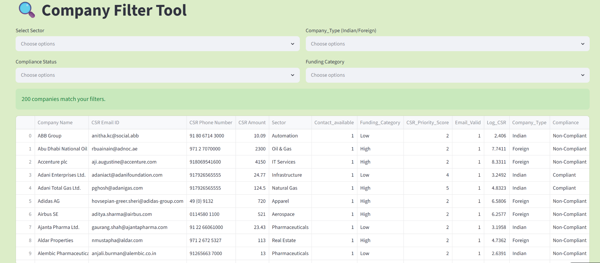
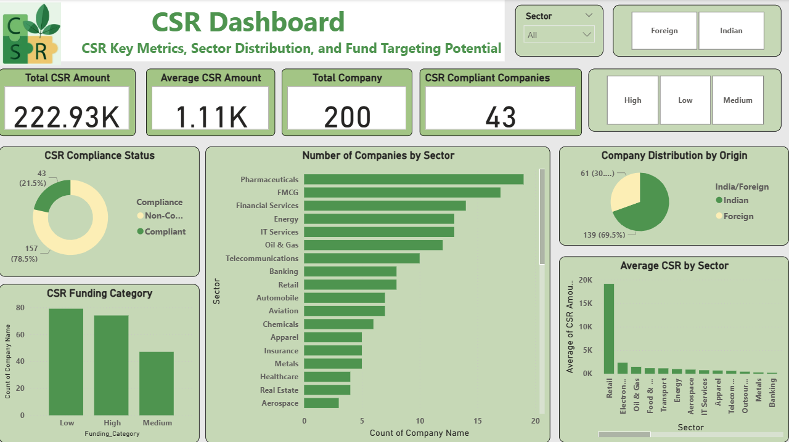
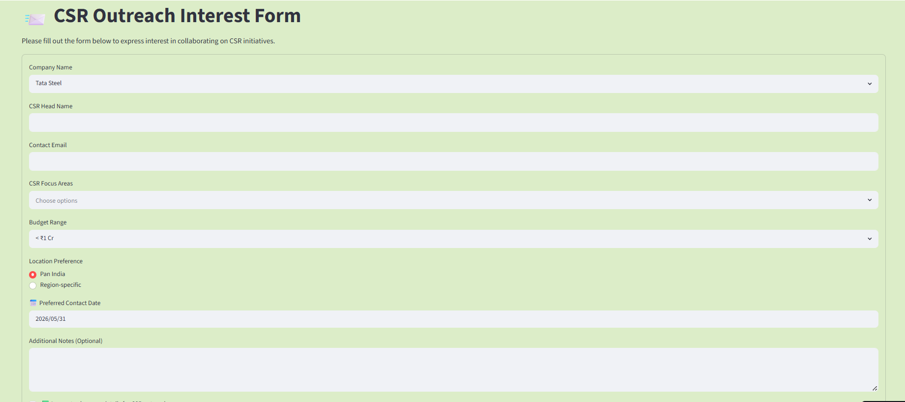

# CSR Insight & Strategy: Data-Driven B2B Outreach Framework
Interactive **Streamlit** and **Power BI** Dashboard built to optimize Corporate Social Responsibility (CSR) resource identification and high-yield NGO funding partnerships.



For NGOs like the Renu Sharma Foundation, identifying corporate funding partners is traditionally slowed down by manual research and cold outreach. This project solves that bottleneck by establishing a structured B2B lead generation pipeline.



By manually sourcing, cleaning, and analyzing corporate governance data for **200+** multi-national companies, I mapped a total market size of **₹222.93 Crores** in active CSR budgets. Through exploratory analysis, the system isolates under-allocated corporations and segments them into **70** high-priority active targets to maximize outreach conversion rates.



## The Problem & Analytical Objective
### The Inefficiency:
Non-profits spend excessive administrative hours tracking down corporate CSR contacts, budget brackets, and compliance records across fragmented public filings.
### The Goal:
Build an end-to-end analytical tool to profile corporate giving trends, identify multi-crore spending gaps, and execute targeted email communication to corporate decision-makers.
### The Strategy: 
Map companies by sector, capital source (Indian vs. Foreign), allocation categories, and strict statutory compliance metrics to pinpoint organizations with significant budget surpluses but limited non-profit engagement.


## Technical Pipeline & Analysis Logic
### 1. Manual Data Sourcing & ETL Processing
Gathered, cross-referenced, and structured data points for **200+** target entities, documenting verified corporate email registries, physical phone channels, and historical CSR budget sizes.
Engineered an automated filtering tool utilizing Pandas dataframes to parse company metrics across distinct operational variables.



### 2. Exploratory Analysis & Compliance Profiling
#### The Compliance Gap:
Exploratory analysis of CSR spending patterns revealed that only **21.5%** of analyzed companies met the defined compliance criteria, leaving over 75% in non-compliant or under-allocated brackets despite carrying massive asset reserves.
#### Origin Concentration: 
Data segmentation shows that domestic Indian firms dominate the volume landscape at **69.5%**, forming the logical baseline for highly localized socio-economic initiatives.




## Project Structure

```text
CSR-Spending-Analysis-Dashboard/
│
├── app.py                          # Main Streamlit dashboard application
├── final_csr_data.xlsx             # Cleaned CSR dataset used for analysis
├── Csr_Analysis.ipynb              # Data cleaning, EDA, and insight generation
├── csr dash.pbix                   # Power BI dashboard file
├── requirements.txt                # Project dependencies
├── README.md                       # Project documentation
│
├── Homepage.png                    # Dashboard home screen
├── KPIs.png                        # Key performance indicators dashboard
├── Features.png                    # Core feature overview
├── Filter.png                      # Interactive filtering interface
├── Outreach.png                    # Outreach recommendation module
├── dashboard.png                   # Main analytics dashboard
├── Company type dashboard.png      # Company-type analysis dashboard
└── Sector based dashboard.png      # Sector-wise CSR analysis dashboard
```

## Core Insights & Data-Driven Actions
### Target Shortlist:
By cross-filtering the macro ledger for companies carrying high-tier budgets but failing to execute compliance standards, the system extracted 70 high-priority active outreach targets.
### Outreach Optimization:
Cold email structures were re-engineered to move away from generic appeals. Instead, the communication strategy targets a company's specific sector deficiency (e.g., identifying IT services as carrying a Poor/30.8% compliance rate versus FMCG at a Good/70.6% rate) to drive engagement.



## Tech Stack
Programming & Core Analysis: Python (Pandas, NumPy)
Application Deployment: Streamlit Framework
Visual Business Intelligence: Power BI DAX modeling, Matplotlib, Seaborn
Database & Structuring: Structured flat-file datasets, custom dictionary mapping


## Project Live Deployment
Live Streamlit Application: Explore the functional engine, test the active filter tools, and evaluate corporate scorecards live at: 
https://csr-spending-analysis-dashboard-tkkljmct2rtmrlzndkcl5v.streamlit.app/

